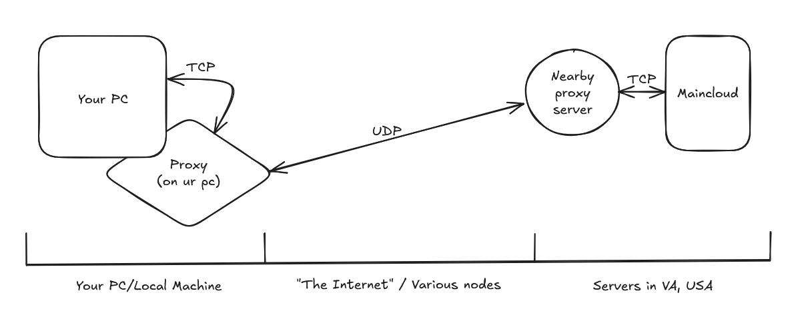
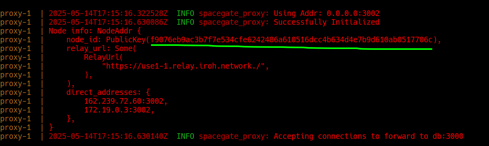
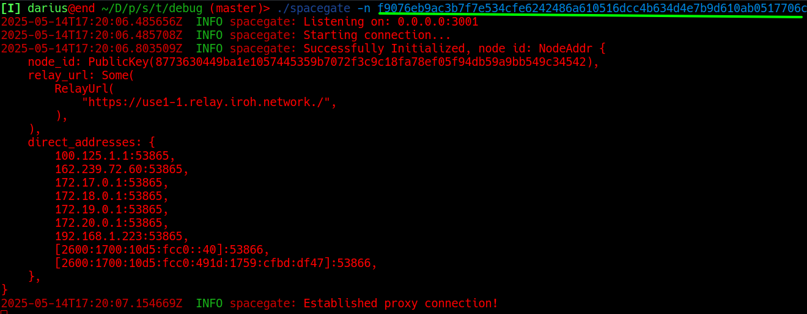

# Spacegate: SpacetimeDB UDP Proxy

## What is Spacegate:

Spacegate is a 2 part proxy that enables UDP data transfer via the [QUIC](https://en.wikipedia.org/wiki/QUIC) protocol to the SpacetimeDB maincloud servers.

## How does Spacegate work:



Spacegate itself is a local application meant to run alongside your SpacetimeDB client. You connect to it instead of the maincloud URI and it will proxy your connection using UDP to a forward proxy hosted physically close to the SpacetimeDB servers. From there, the forward proxy server routes your data to and from maincloud.

I personally run the forward proxy as a shared resource for those that want to use it.

## How to use Spacegate:

### Building:

To build the clientside proxy, with `rust` installed:

```bash
cargo build -r -p spacegate
```

### Releases:

Alternatively to building yourself, you can simply download a prebuild binary from the [releases](https://github.com/suirad/spacegate/releases) page of this repository.

### Usage:

1. Run the `spacegate` application. Once you see a printout that the proxy connection is established it is ready to use.
  * Can be run within or outside of a terminal; though within a terminal will show any errors that occur.
2. In your StDB client, change your maincloud connection uri from `wss://maincloud.spacetimedb.com` to `ws://localhost:3001`.
  * If your application stores maincloud tokens, clear them to be replaced by new ones from the proxy.
    * Unity: `edit -> clear player prefs`
    * Typescript: clear local storage
3. Enjoy!

### Additional notes:

* Using `spacetime cli` with `spacegate`:
  ```bash
  spacetime server add --url http://localhost:3001 spacegate
  spacetime server set-default spacegate
  ```
## New in v1.1: Self Hosting


In this new release, you can now self host the far proxy for you or someone else to connect to your own self hosted SpacetimeDB server without port openings. 


All that is needed to enable this functionality is to run `spacegate-proxy` and ensure it is forwarding to your SpacetimeDB instance. Be sure to make note of the nodeid for your spacegate-proxy server.(Highlighted above)

[There is an example of running SpacetimeDB and the proxy together in a docker-compose file](example/docker-compose.yml).


Then to connect `spacegate` to your own `spacegate-proxy`, simply run `spacegate -n <proxy-node-id>`.

Congratulations, you can now connect from your SpacetimeDB client, through your local spacegate client, out of the far spacegate proxy, to your self hosted SpacetimeDB server.

### How does this work

Spacegate's networking is based upon the fine work of the [Iroh Project](https://www.iroh.computer/docs/overview) where a layer of p2p discovery and routing is created above the QUIC UDP protocol.
